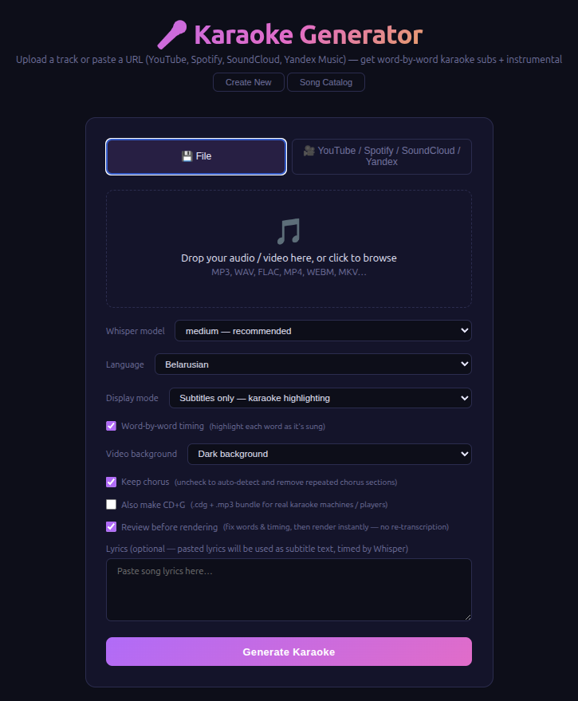

# Karaoke Generator

Local web app that takes a music track (file upload or URL from YouTube, Spotify, SoundCloud, Yandex Music) and produces:
- **`_karaoke.mp4`** — 1080p video with karaoke subtitles (word-by-word highlighting)
- **`_minus.mp3`** — Instrumental (vocals removed)
- **`_karaoke.ass`** — Raw ASS subtitle file for use in VLC, mpv, Aegisub, etc.
- **`.cdg` + `.mp3` bundle** _(optional)_ — CD+G, the format real karaoke machines and MP3+G players use



## Stack

| Step | Tool |
|---|---|
| YouTube / SoundCloud / Yandex Music download | `yt-dlp` |
| Spotify download | `spotdl` (isolated via pipx) |
| YouTube subtitle extraction | `yt-dlp --write-subs` |
| Vocal separation | `demucs` (`htdemucs` model) |
| Transcription | `faster-whisper` (CUDA `int8_float16` / CPU `int8`) |
| Lyrics correction | custom `lyrics_correction.py` (anchor/gap alignment) |
| ASS generation | custom `ass_gen.py` |
| CD+G generation | custom `cdg_gen.py` (Pillow for glyph rasterisation) |
| Video rendering | `ffmpeg` (libx264 + libass burn-in) |
| Song catalog | SQLite (`work/catalog.db`) |
| Web UI | FastAPI + vanilla JS |

## Quick start (Docker — recommended)

```bash
# GPU (default)
docker compose up --build

# CPU only
WHISPER_DEVICE=cpu docker compose up --build

# open http://localhost:8021
```

Requires [NVIDIA Container Toolkit](https://docs.nvidia.com/datacenter/cloud-native/container-toolkit/install-guide.html) for GPU mode.

## Quick start (local)

```bash
sudo apt install ffmpeg fonts-liberation
python3 -m venv .venv && source .venv/bin/activate
pip install torch torchaudio --index-url https://download.pytorch.org/whl/cu121
pip install -r requirements.txt
# For Spotify support:
pipx install spotdl
uvicorn main:app --host 0.0.0.0 --port 8000
```

## Features

### Audio sources
- **File upload** — MP3, WAV, FLAC, MP4, WEBM, MKV
- **YouTube / YouTube Music** — paste URL, audio downloaded via yt-dlp
- **Spotify** — paste `open.spotify.com/track/...` URL, downloaded via spotdl
- **SoundCloud** — paste URL, downloaded via yt-dlp
- **Yandex Music** — paste URL, downloaded via yt-dlp

### Language support
- **Auto-detect** or manual selection: EN, RU, **BE** (Belarusian), PL, DE, FR, ES, IT, PT, NL, TR, AR, JA, KO, ZH
- Belarusian mode uses a native seed prompt to prevent Whisper defaulting to Russian

### Lyrics
Priority chain (highest to lowest):
1. **User-pasted lyrics** — used as subtitle text, timed by Whisper
2. **YouTube subtitles** — auto-extracted from the video if available
3. **syncedlyrics** — searches Spotify, Musixmatch, Genius, NetEase (returns synced LRC when available)
4. **lrclib.net** — free API with good Cyrillic coverage
5. **Yandex Music** — good for Russian/Belarusian songs
6. **Genius** — via `lyricsgenius` (requires `GENIUS_ACCESS_TOKEN` env var)

When synced lyrics (LRC format) are found, their line-level timestamps are preserved and used as segment anchors for better timing accuracy.

#### Anchor-based lyrics correction
When reference lyrics are available (pasted or fetched), the Whisper transcription is **corrected against them** instead of trusting Whisper's text. The two word streams are aligned; matching runs become **anchors** (Whisper's timing is kept, reference spelling is used) and the mismatching **gaps** between anchors are replaced with the reference words, their timing interpolated from the surrounding anchors. This is a dependency-free take on the approach from [nomadkaraoke/karaoke-gen](https://github.com/nomadkaraoke/karaoke-gen)'s `lyrics-transcriber`, and it survives Whisper segmenting the audio differently from how the lyrics are line-broken.

Lyrics are displayed in the results UI and can be **edited and re-submitted** — the app re-runs transcription with the updated text (skips Demucs).

### Subtitle timing
- **Character-weighted word distribution** — longer words get proportionally more time (not equal per word)
- **Whisper-to-lyrics word alignment** — when both Whisper timestamps and lyrics exist, a greedy alignment transfers Whisper's timing to the correct lyric words
- **LRC timestamp preservation** — synced lyrics timestamps used as line-level anchors
- **Minimum word duration** — 150ms floor to prevent flicker
- **Gap threshold** — gaps under 100ms are absorbed into word duration

### Display modes
- **Subtitles only** — word-by-word karaoke highlighting (default)
- **Background text only** — full lyrics shown on screen, no timing (requires pasted lyrics)
- **Both** — karaoke subtitles at bottom + full lyrics dimmed in the upper area

### Video background
- **Dark background** — solid dark blue (default)
- **Original video** — overlays karaoke subtitles on the YouTube video (YouTube only)
- **Cover image** — 5-second intro with uploaded image or auto-fetched YouTube thumbnail

### Chorus detection
- Auto-detects repeated lyric blocks (chorus/refrain)
- Option to **keep** (default) or **remove** repeated chorus sections
- When removed, only the first occurrence is kept

### Interactive review (optional)
Tick **"Review before rendering"** to pause the pipeline once the word-timed segments are ready — *before* the video is rendered — and open an in-browser editor:
- **Fix wrong words** inline. If a line keeps the same word count (fixing one misheard word), the original per-word timing is preserved; otherwise the line's words are re-spread across its span.
- **Adjust timing** by editing each line's start/end, or click **⇤** to set a line's start to the current playhead.
- **Tap-sync**: play the instrumental and press <kbd>Space</kbd> (or click a line) as each line begins to capture its timing live.
- **Delete** junk lines.

Hitting **Render** commits the edits and produces the video in seconds — it re-runs only the subtitle + ffmpeg step, **not** Demucs or Whisper. (The lyrics editor and rating auto-retry still re-run transcription, since their job is to re-time against changed text.)

### CD+G output (optional)
Tick **"Also make CD+G"** on the create form to additionally produce a `.cdg` + `.mp3` bundle (downloaded as a ZIP with matching basenames — an MP3+G set). CD+G is the format real karaoke machines, hardware players, and desktop players (VLC, cdg players) understand. The generator renders the same word-timed data used for the ASS subtitles into a standards-compliant CD+G stream (50×18 grid of 6×12 tiles at 300 packets/sec) with a left-to-right character wipe as each word is sung.

### Song catalog
- **Persistent SQLite database** — songs survive container restarts
- **Catalog UI** — browse, search, download, delete past songs
- **Prepare for YouTube** — generates thumbnail (1280x720), metadata JSON (title, description, tags), and bundles everything into a ZIP

### Hallucination filtering
- Segments repeated 3+ times are dropped
- Segments with < 25-30% word overlap with lyrics vocabulary are dropped
- Belarusian/Russian Cyrillic variants normalised before comparison
- Belarusian seed prompt echo detection

### Rating & auto-retry
After results are ready, rate the output (1-5 stars) for text accuracy and video sync. If either rating is < 4, transcription is automatically retried with adjusted Whisper settings (up to 2 retries). Demucs vocal separation is reused.

| Attempt | beam_size | no_speech_threshold | temperature |
|---|---|---|---|
| 1 (initial) | 5 | 0.6 | 0.0 |
| 2 | 10 | 0.4 | 0.0 |
| 3 | 10 | 0.3 | 0.0 / 0.2 / 0.4 |

### GPU support
- Auto-detects `WHISPER_DEVICE` env var (`cuda` / `cpu`)
- Falls back to CPU automatically on CUDA out-of-memory
- GTX 1650 (4 GB) works with `int8_float16` up to `large-v3`

## Environment variables

| Variable | Default | Description |
|---|---|---|
| `WHISPER_DEVICE` | `cuda` | Whisper device (`cuda` or `cpu`) |
| `GENIUS_ACCESS_TOKEN` | _(empty)_ | Optional Genius API token for lyrics fallback |

## Output format — ASS karaoke

Each Whisper segment becomes one `Dialogue:` line. Words use `{\kf<cs>}` tags:
- `cs` = centiseconds (1/100 s)
- `\kf` = karaoke fill — text wipes from secondary colour (white, unsung) to primary colour (yellow, sung)

Compatible with VLC, mpv, Aegisub, kdenlive, and ffmpeg subtitle burn-in.
